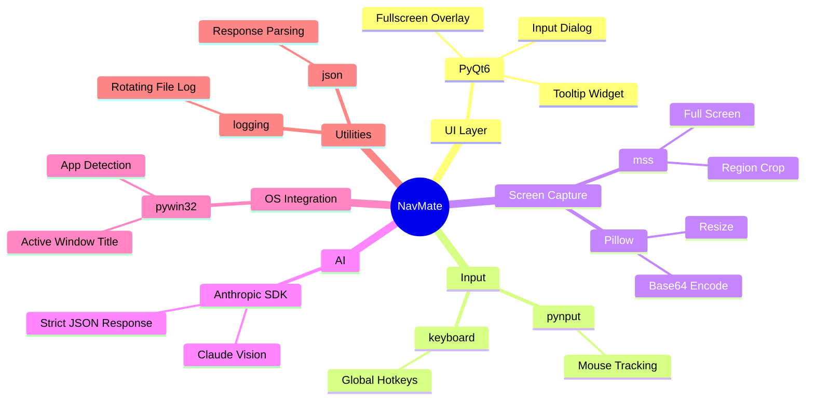
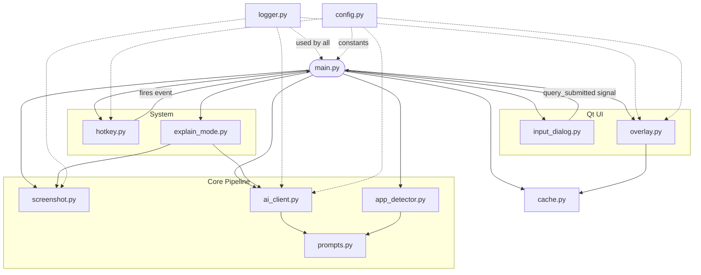
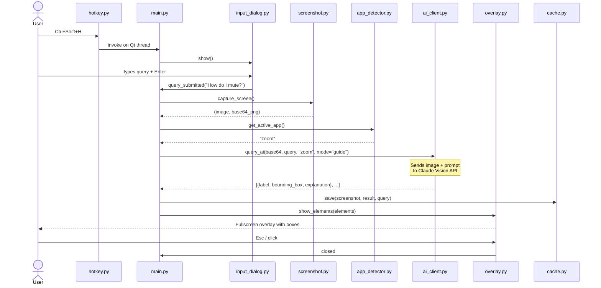
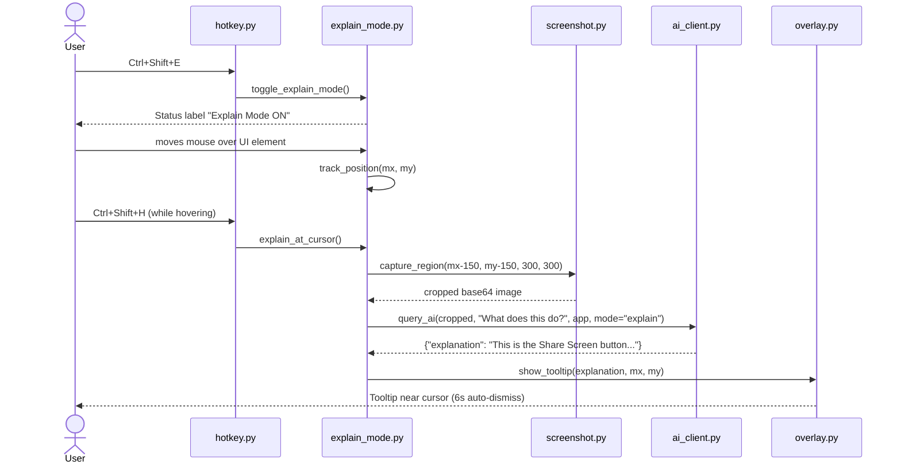
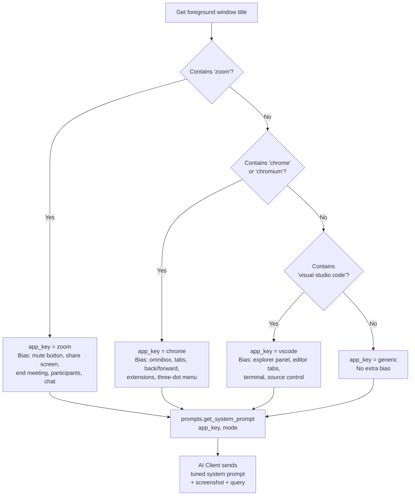
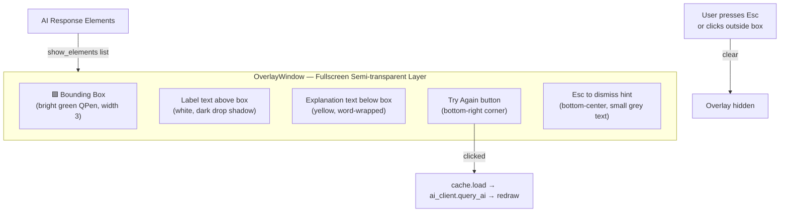

# NavMate — Architecture & Tech Stack Diagrams

---

## 1. Tech Stack

---

## 2. Module Dependency Graph

---

## 3. Main Flow — Sequence Diagram

---

## 4. Explain Mode — Sequence Diagram

---

## 5. App-Specific Prompt Tuning — Decision Tree

---

## 6. Overlay Rendering — Component Layout

---

## 7. Data Flow — Screenshot to Overlay

```mermaid
flowchart LR
    A([Screen]) -->|mss capture| B[Raw PIL Image\nfull resolution]
    B -->|Pillow resize\nmax 1920px| C[Resized PIL Image]
    C -->|base64 encode| D[PNG base64 string]
    D -->|anthropic SDK\nmessages.create| E[Claude Vision API]
    E -->|response.content| F[Raw JSON string]
    F -->|json.loads + validate| G[List of Element Dicts]
    G -->|show_elements| H([Overlay Window])

    style E fill:#d4a,color:#fff
    style H fill:#0a8,color:#fff
```

